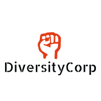

# Why are we here?

We are focused on holding corporations accountable.

In response to the Black Lives Matter, many corporations posted simple solidarity statements without committing to actual change.
We want to hold corporations accountable by highlighting the change (or lack of change) they have implemented in their teams, as well as the diversity of the leadership in their corporation.

# How to get started

This app is built on the static-site generator [11ty](https://www.11ty.dev/). The design uses [Bootstrap4](https://getbootstrap.com/docs/4.0/getting-started/introduction/).

### 1. Clone this Repository

```
git clone https://github.com/DiversityCorp/companies-on-blm.git
```

### 2. Navigate to the directory

```
cd companies-on-blm
```

### 3. Install dependencies

```
npm install
```

### 4. Install Eleventy

```
npm install -g @11ty/eleventy
```

### 5. Run the Eleventy server locally

```
npm run serve
```

### 6. Open localhost:8080 on the browser of your choice! ✨

### Implementation Notes

- `companies/` has the company data. All that is required is the company value.
- look in the `examples` folder for a template on how to add data for a company.
- This site uses two layouts:
  - `_includes/layouts/base.njk`: the top-level HTML structure
  - `_includes/layouts/company.njk`: the company page template (wrapped into `base.njk`)
